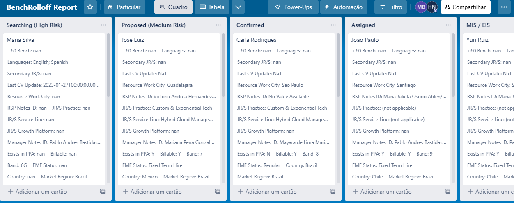

<h1 align="center">
  
</h1>

<h3 align="center">TRELLO TO EXCEL</h3>
<h3 align="center">=================</h3>

  

<h3>About the project</h3>

This project is an exclusive request of the human resources sector of my company and aims, above all, to automate the process of exporting excel sheets to <b>Trello</b>.

<b>Trello</b> is a framework-based project management platform that allows users to organize tasks, manage projects and work with teams in a visual and intuitive way. It is highly flexible and can be used to manage projects from small to large, from personal tasks to complex business projects.

<h3>How to Run</h3>

To run the project, there is a simpler way. First, clone the repository to any destination on your machine.

If your operating system is Windows:
  <ul>
    <li>Open trello folder via terminal</li>
    <li>Enter the code: .\exec\win\init.bat</li>
    <li>(You can also set this path in Windows PATH)</li>
  </ul>

If your operating system is different from Windows (MAC or LINUX):
  <ul>
    <li>Open trello folder via terminal</li>
    <li>Enter the code: ./exec/others/init.sh</li>
  </ul>

The project starts with the "init.py" script that will ask you for some parameters: Keyacess, TokenAcess, Path+Excel_Name, and name of the worksheet you want to automate. Once this is done, it will create a workspace in <b>Trello</b>, inserting the lists, cards and custom fields. In the end, you will be able to use <b>Trello</b> normally.

<i>Note: For custom fields to work, you need to be a premium Trello member</i>.

All API documentation can be found here: https://developer.atlassian.com/cloud/trello/

<h3>Result</h3>

  

